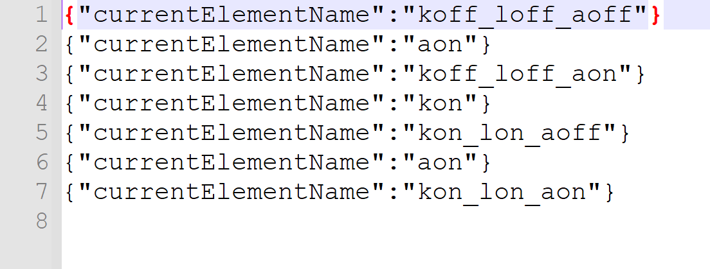

<!-- PROJECT LOGO -->
 

  

  <h1 align="center">Model-Based Testing Tool</h1>

  

    This is the second part of the testing tool. 
     
    <a href="https://github.com/"><strong>for first part »</strong></a>
     
     
    </a>
  

<!-- ABOUT THE PROJECT -->

<h2 align="center">About The Project</h2>

This project aims to test the accuracy of Html-based models created during model-based development processes of systems with the help of test sequences.

The testing process consists of two steps:
* Model transform 
* Testing processes

This part focus on model transform. 

<a href="https://github.com/"><strong> --> Model Transform</strong></a>

<a href="https://github.com/"><strong> --> Testing Processes</strong></a>

## Testing 

In this project, "GraphWalker" was used to generate test sets for model testing.

<a href="https://graphwalker.github.io/"><strong> GraphWalker web page</strong></a>

<a href="https://github.com/GraphWalker/graphwalker-project"><strong> GraphWalker gitHub page</strong></a>

## Getting Started

First, the java file containing the information of the model to be tested is added to the testing project folder.

Second, the text file consisting of test sequences is defined in the testing program.

Finally, after the program is run, the accuracy of the model is finalized according to the test sequences.

Each test operation takes about 1 unit operation. Thus, the time complexity of the test operation is O(n), where n is the length of the test sequence.

An example test sequence is given below:

## License

Distributed under the MIT License. See `LICENSE` for more information.

## Contact

Hasan YİĞİT - [@ygthasan](https://www.linkedin.com/in/ygthasan/) - yigithasan22@gmail.com

Project Link: [https://github.com/ygt22](https://github.com/ygt22)
Project Link: [https://bitbucket.org/ygt22](https://bitbucket.org/ygt22/)

<a href="https://github.com/othneildrew/Best-README-Template"><strong> readMe.md template</strong></a>

